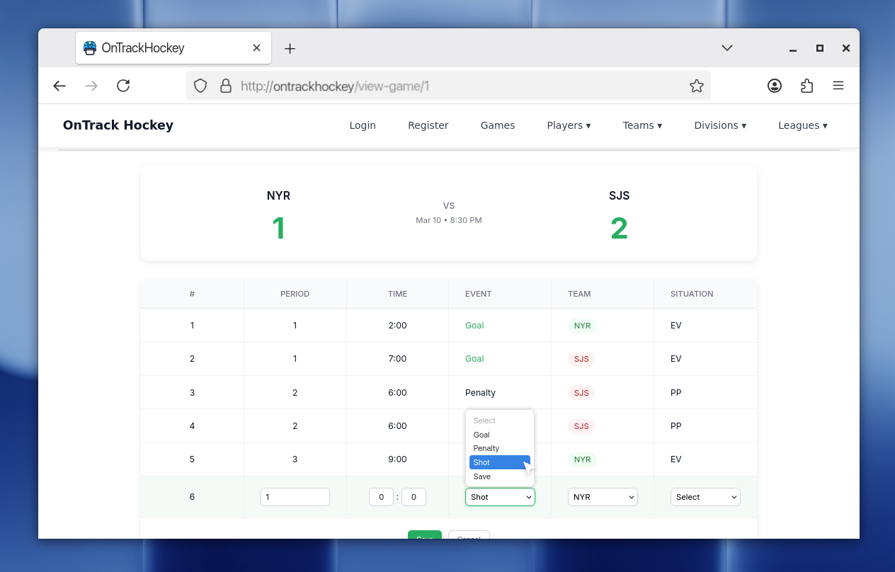
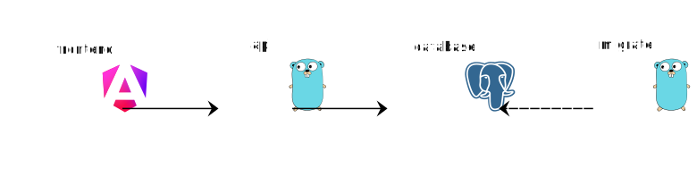

# OnTrackHockey

Hockey SMS (Sports Management System)

- On-Track-Hockey is a sports management system for organizing and managing hockey data including players, teams, and leagues.  
- The project is designed as a modern, containerized application with a clean separation between frontend, backend, and database layers.



> `v0.21` _screenshot of game event creation_

## Stack



## Status

Active development

## Getting Started

Prerequisites

- Docker & Docker Compose

*or run from source*

- Go
- Node.js
- PostgreSQL

### Run with Docker (recommended)

```bash
docker compose up --build
```

Frontend: http://localhost:8080  
Backend: http://localhost:3000

## Contributing

Contributions are welcome, but please follow these guidelines:

1. Keep pull requests small and focused on a single issue.
2. Do not submit large AI-generated pull requests.
